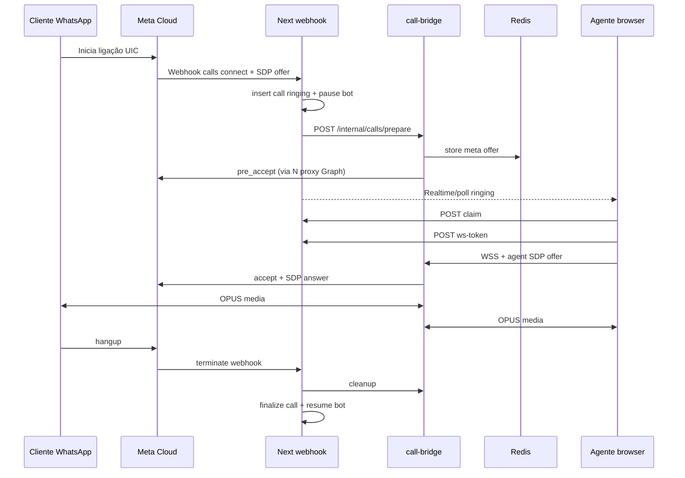

# Checklist — WhatsApp UIC (voz recebida) + WebRTC bridge self-hosted

Origem: análise 2026-08-28. Atualizar `Estado` (`[ ]` → `[x]` + data) ao concluir cada item.

**Escopo deste épico:** **somente UIC** (cliente liga → empresa atende na inbox web).  
**Fora deste épico:** BIC (empresa liga pro cliente), SIP/PABX, gravação obrigatória, IVR, fila ACD avançada.

**Processo:** uma fase por vez até `npm test` verde; migrations via MCP `apply_migration` +
validação `execute_sql`; postura pré-produção radical (sem dual-path legado após cutover).

**Relacionado:**
- [`CHECKLIST_CANAIS_WABA_IG_MESSENGER.md`](./CHECKLIST_CANAIS_WABA_IG_MESSENGER.md) — credenciais WABA
- [`CHECKLIST_ARCH_PRO_SCALE.md`](./CHECKLIST_ARCH_PRO_SCALE.md) — filas, Redis Upstash, cron
- [`governanca-seguranca-negocio.mdc`](../.cursor/rules/governanca-seguranca-negocio.mdc) — SELECT view / mutação RPC

**Pré-requisitos Meta (operacional, fora do código):**
- Número na Cloud API (não app WhatsApp Business comum)
- Limite ≥ 2.000 conversas únicas/dia (ou conta sandbox)
- App inscrito no webhook field **`calls`**
- Calling habilitado no número (`call_hours`, `call_icon_visibility`)
- Doc: [Cloud API Calling](https://developers.facebook.com/docs/whatsapp/cloud-api/calling/)

---

## Decisões fechadas

| # | Tema | Decisão |
|---|------|--------|
| D1 | Direção | **UIC only** — receber ligação do cliente WhatsApp |
| D2 | Mídia | **WebRTC no browser** (Opção B) com **bridge dedicado self-hosted** (sem Twilio/carrier) |
| D3 | Deploy | **Control plane** = Next.js (Vercel); **media plane** = serviço always-on (`call-bridge`) em VPS |
| D4 | Signaling | WebSocket no bridge (não Supabase Realtime para ICE/SDP) |
| D5 | Estado efêmero | SDP/ICE em **Upstash Redis** TTL curto; DB guarda metadados da chamada, não SDP completo |
| D6 | Plan gate | Feature **`whatsapp_voice_uic`** — Pro + Market (Essencial: off) |
| D7 | RBAC | Atender/recusar exige **`whatsapp.operate`**; configurar calling exige **`settings.company`** |
| D8 | Multi-agente | **Claim atômico** por chamada (1 agente); demais veem “em atendimento por X” |
| D9 | Bot durante call | **Pausar bot** na thread enquanto `status = ringing \| connected` (handover implícito) |
| D10 | Custo | UIC gratuito Meta; custo infra = VPS bridge + (opcional) coturn no mesmo VPS |

---

## Resumo de fases

| Fase | Escopo | Estado |
|------|--------|--------|
| **V0** | Pré-flight Meta + health probe calling | [ ] |
| **V1** | Schema, RLS, RPCs, contratos Zod | [ ] |
| **V2** | Webhook `calls` + persistência + dedup | [ ] |
| **V3** | Serviço `call-bridge` (media plane MVP) | [ ] |
| **V4** | APIs tenant (claim, accept, reject, token WS) | [ ] |
| **V5** | UI inbox (incoming banner + painel ativo) | [ ] |
| **V6** | Config Canais (toggle calling + call_hours UI) | [ ] |
| **V7** | Observabilidade, testes, runbook | [ ] |
| **V8** | Hardening escala (multi-instância bridge, TURN) | [ ] |

---

## Estrutura-alvo (Clean Architecture nesta stack)

```text
┌─────────────────────────────────────────────────────────────────────────┐
│ Presentation (Next.js / React)                                          │
│   app/(admin)/whatsapp/page.tsx              # integra IncomingCall*      │
│   components/whatsapp/                                                    │
│     IncomingCallBanner.tsx                  # toast/modal chamada entrante│
│     ActiveCallPanel.tsx                     # mute, timer, encerrar     │
│     CallStatusBadge.tsx                     # ringing / connected         │
│   components/channels/                                                    │
│     WhatsappCallingSettingsPanel.tsx        # toggle + call_hours (V6)    │
└─────────────────────────────────────────────────────────────────────────┘
                                    │
                                    ▼ HTTP (session cookie + capability)
┌─────────────────────────────────────────────────────────────────────────┐
│ API — Control plane (Route Handlers, server-only)                       │
│   app/api/whatsapp/incoming/route.ts         # + field "calls" (V2)       │
│   app/api/whatsapp/calls/route.ts            # GET active/ringing         │
│   app/api/whatsapp/calls/[callId]/claim/route.ts                          │
│   app/api/whatsapp/calls/[callId]/accept/route.ts                         │
│   app/api/whatsapp/calls/[callId]/reject/route.ts                         │
│   app/api/whatsapp/calls/[callId]/terminate/route.ts                      │
│   app/api/whatsapp/calls/[callId]/ws-token/route.ts   # JWT curto p/ WS │
│   app/api/admin/whatsapp-channel/calling/route.ts   # GET/PATCH settings  │
└─────────────────────────────────────────────────────────────────────────┘
                                    │
                                    ▼ ports
┌─────────────────────────────────────────────────────────────────────────┐
│ Application (lib/whatsapp/calling/)                                       │
│   handleCallConnectWebhook.ts                                               │
│   handleCallTerminateWebhook.ts                                             │
│   handleCallStatusWebhook.ts          # opcional: ringing updates         │
│   resolveCallThread.ts                # phone_e164 → thread_id            │
│   issueAgentCallToken.ts              # JWT HS256, aud=call-bridge        │
│   metaCallActions.ts                  # pre_accept | accept | reject      │
│   pauseBotForCall.ts                  # handover_at + bot_active=false      │
│   resumeBotAfterCall.ts                                                   │
└─────────────────────────────────────────────────────────────────────────┘
                                    │
          ┌─────────────────────────┼─────────────────────────┐
          ▼                         ▼                         ▼
┌──────────────────┐   ┌──────────────────────┐   ┌─────────────────────┐
│ Domain           │   │ Adapters             │   │ Infra efêmera       │
│ src/domain/      │   │ metaCallGateway.ts   │   │ Upstash Redis       │
│  contracts/      │   │ callBridgeHttp.ts    │   │  call:{id}:sdp:*    │
│  whatsappCalling │   │ callRepository.*     │   │  call:{id}:lock     │
│ .ts (Zod)        │   │                      │   │                     │
│ src/domain/ports/│   │                      │   │                     │
│  callBridge.port │   │                      │   │                     │
│  callRepo.port   │   │                      │   │                     │
└──────────────────┘   └──────────────────────┘   └─────────────────────┘

┌─────────────────────────────────────────────────────────────────────────┐
│ Media plane — serviço separado (always-on, NÃO Vercel)                  │
│   services/call-bridge/  (ou repo irmão rentus-call-bridge)             │
│     src/server.ts                    # Fastify + @fastify/websocket       │
│     src/auth/verifyBridgeJwt.ts                                           │
│     src/meta/MetaPeerConnection.ts   # wrtc ↔ Meta SDP (OPUS)           │
│     src/agent/AgentPeerConnection.ts # wrtc ↔ browser SDP               │
│     src/session/CallSessionManager.ts                                     │
│     src/health/route.ts                                                   │
│   Dockerfile + docker-compose (coturn opcional)                           │
└─────────────────────────────────────────────────────────────────────────┘
                                    ▲
                                    │ WSS + JWT
                          Browser (RTCPeerConnection nativo)

Data / DB (Supabase)
  public.whatsapp_calls              # metadados + status machine
  public.whatsapp_call_events        # audit trail (sem SDP)
  public.whatsapp_channels             # + calling_enabled, call_settings jsonb
  RPC rpc_claim_whatsapp_call          # SKIP LOCKED, 1 agente
  RPC rpc_finalize_whatsapp_call       # terminate + duração
  (sem view pública — leitura só via API server-side)
```

---

## Contratos tipados (domain)

**Arquivo:** `src/domain/contracts/whatsappCalling.ts`

| Schema Zod | Uso |
|------------|-----|
| `WhatsappCallDirectionSchema` | `"inbound"` (UIC neste épico) |
| `WhatsappCallStatusSchema` | `ringing` \| `claimed` \| `pre_accepting` \| `connected` \| `ended` \| `missed` \| `rejected` \| `failed` |
| `WhatsappCallEndReasonSchema` | `agent_hangup` \| `customer_hangup` \| `timeout` \| `rejected` \| `bridge_error` \| `meta_error` |
| `WhatsappCallPublicSchema` | DTO API → UI (sem SDP, sem tokens) |
| `MetaCallConnectWebhookSchema` | parse webhook `calls` connect |
| `MetaCallTerminateWebhookSchema` | parse terminate |
| `ClaimCallResponseSchema` | `{ call, wsUrl, wsToken, expiresAt }` |
| `AcceptCallBodySchema` | `{ agentSdpOffer: string }` — validar tamanho max |
| `WhatsappCallingSettingsSchema` | `{ enabled, callHours, iconVisibility }` |
| `BridgeWsMessageSchema` | discriminated union: `ice` \| `sdp_answer` \| `ping` \| `error` |

**Port interfaces:** `src/domain/ports/callBridge.port.ts`, `callRepository.port.ts`

```typescript
// Exemplo contrato port (não implementar ainda — referência)
interface CallBridgePort {
  prepareInbound(params: {
    callId: string;
    companyId: string;
    metaSdpOffer: string;
  }): Promise<{ bridgeSessionId: string }>;

  attachAgent(params: {
    callId: string;
    agentSdpOffer: string;
    wsToken: string;
  }): Promise<{ agentSdpAnswer: string }>;

  terminate(callId: string, reason: WhatsappCallEndReason): Promise<void>;
}
```

**Regra:** nenhum `any` no hot path webhook → RPC → bridge; falha de parse = log + 200 ao Meta (evitar retry storm) + evento `failed`.

---

## Camadas de segurança

| Camada | O quê | Onde |
|--------|-------|------|
| S1 | Assinatura webhook Meta (`x-hub-signature-256`) | `incoming/route.ts` (já existe — reutilizar) |
| S2 | Rate limit inbound webhook | já existe — manter |
| S3 | RLS + FORCE + policy `service_role_only` | tabelas novas |
| S4 | REVOKE anon/authenticated | migrations |
| S5 | Mutação só RPC transacional | claim/finalize |
| S6 | Tenant isolation | todo RPC valida `company_id` via sessão + row lock |
| S7 | Capability RBAC | `whatsapp.operate` / `settings.company` |
| S8 | Plan gate | `whatsapp_voice_uic` |
| S9 | JWT bridge curto (≤ 120s, `aud`, `call_id`, `agent_user_id`, `company_id`) | `ws-token` API |
| S10 | Bridge valida JWT + call status `claimed` antes de ICE | call-bridge |
| S11 | SDP/ICE **não** persistido em Postgres; Redis TTL 5 min | estado efêmero |
| S12 | Secrets bridge (`CALL_BRIDGE_JWT_SECRET`, `CALL_BRIDGE_INTERNAL_KEY`) | env VPS + Vercel |
| S13 | Comunicação Next→Bridge | header `X-Internal-Key` + mTLS futuro (V8) |
| S14 | Logs sem SDP completo | mascarar em Sentry |
| S15 | Empresa suspensa | drop webhook (padrão `incoming` atual) |
| S16 | Idempotência webhook | unique `provider_call_id` + event dedup |

**Anti-padrões proibidos:**
- Browser chamando Graph API Meta diretamente
- Frontend lendo `whatsapp_calls` via Supabase client
- Guardar access token WABA no bridge (só Next.js injeta token por request interno)
- Aceitar chamada sem claim atômico (race multi-tab)

---

## Gargalos e mitigações

| # | Gargalo | Impacto | Mitigação |
|---|---------|---------|-----------|
| G1 | **Vercel serverless não segura WebRTC** | Chamada impossível se mídia rodar no Next | Bridge always-on fora da Vercel (D3) |
| G2 | Janela Meta **30–60s** para accept | “Não atendida” + restrição pickup rate | `pre_accept` imediato no webhook; UI Realtime poll 1s; som + notificação browser |
| G3 | Cold start webhook Vercel | Atraso no connect | Webhook só persiste + dispara bridge async; bridge faz pre_accept (< 3s SLA interno) |
| G4 | **1 agente offline** | 100% missed | V6: horário calling; futuro: fila + fallback celular (fora épico) |
| G5 | Multi-tab / multi-agente race | Dois atendem mesma call | RPC `claim` SKIP LOCKED + status `claimed` |
| G6 | NAT/firewall agente | Áudio one-way | coturn self-hosted (V8); métrica `ice_failed` |
| G7 | Autoplay browser | Cliente não ouve agente | `ActiveCallPanel` exige gesto user no Accept |
| G8 | Bridge SPOF | Queda = zero voz | Health check + restart Docker; V8: 2 instâncias + sticky `call_id` |
| G9 | Pico simultâneo (Black Friday) | CPU bridge saturada | Limite `MAX_CONCURRENT_CALLS` por instância; fila busy tone Meta |
| G10 | Bot respondendo durante call | UX caótica | D9 pause bot + suppress chatbot_queue na thread |
| G11 | Upstash indisponível | SDP perdido | Fail closed: reject call + log; não aceitar sem Redis |
| G12 | OPUS ↔ G.711 transcode | Qualidade ruim | Manter OPUS ponta a ponta; proibir transcode no bridge |

---

## Furos na estrutura anterior (corrigidos neste plano)

| Furo | Problema | Correção neste checklist |
|------|----------|--------------------------|
| F1 | Supabase Realtime como signaling WebRTC | WebSocket dedicado no bridge (D4) |
| F2 | WebRTC dentro de Route Handler | Media plane separado (D3) |
| F3 | Sem dedup webhook calls | unique `provider_call_id` (V2) |
| F4 | Sem claim multi-agente | RPC SKIP LOCKED (D8, V1) |
| F5 | SDP no banco | Redis TTL (D5) |
| F6 | Sem plan gate | `whatsapp_voice_uic` (D6) |
| F7 | Health probe não valida calling | V0 estende probe (`can_receive_call_sip` / settings) |
| F8 | Bot + voz simultâneos | D9 pause/resume |
| F9 | Token WABA no browser | S9 JWT scoped só ao bridge |
| F10 | Deploy único monolito | Control vs media plane explícito |
| F11 | Sem timeout worker se agente sumir | watchdog bridge + RPC finalize `timeout` |
| F12 | Incoming só `field=messages` | V2 processa `calls` no mesmo endpoint ou router dedicado |

---

## Melhorias e recursos (prioridade)

### MVP (V0–V7) — obrigatório

- [ ] Banner + som chamada entrante (Web Audio / Notification API se permitido)
- [ ] Timer duração; mute local; encerrar
- [ ] Card na thread: “Última ligação há X min”
- [ ] Eventos audit em `whatsapp_call_events`
- [ ] Métricas: `calls_received`, `calls_answered`, `calls_missed`, p95 time-to-accept
- [ ] Runbook: bridge down, Meta 130472, ICE failed

### Pós-MVP (backlog explícito)

| Recurso | Valor | Fase futura |
|---------|-------|-------------|
| Fila round-robin N agentes | Escala equipe | V9 |
| Gravação (com consentimento LGPD) | QA / disputa | V10 |
| Transcrição pós-call (Whisper) | CRM | V10 |
| Widget “ligar de volta” (deep link UIC) | Cliente religa fácil | V11 |
| Dashboard pickup rate | Evitar restrição Meta | V9 |
| SIP bridge (FreeSWITCH) | Telefone físico | Épico separado |
| BIC outbound | Cobrança proativa | Épico separado |

---

## V0 — Pré-flight Meta + health

### V0.1 — App Meta

- [ ] Webhook field **`calls`** inscrito (mesmo callback URL ou path dedicado documentado)
- [ ] Permissão `whatsapp_business_messaging` válida (já usada)
- [ ] Verificar elegibilidade número (limite 2k, payment method)

### V0.2 — Habilitar calling no número

- [ ] PATCH call settings via Graph (sandbox/staging primeiro)
- [ ] `call_icon_visibility` = BR-only se necessário (`restrict_to_user_countries`)
- [ ] `call_hours` alinhado ao expediente empresa

### V0.3 — Estender health probe

**Arquivo:** `lib/channels/probeWhatsappChannelHealth.ts`

- [ ] GET `/{phone-number-id}?fields=...,calling` (ou endpoint settings doc Meta)
- [ ] Persistir `calling_enabled`, `can_receive_call_sip` em `whatsapp_channels.provider_metadata.calling` ou colunas dedicadas
- [ ] UI `ChannelHealthBadge`: “Voz: ativa / indisponível / não configurada”

**Validação:** health retorna erro claro se calling off.

---

## V1 — Schema, RLS, RPCs, contratos

### V1.1 — Migration `whatsapp_calls`

**Arquivo:** `supabase/migrations/YYYYMMDDHHMMSS_whatsapp_uic_calls.sql`

**Tabela `whatsapp_calls`:**

| Coluna | Tipo | Notas |
|--------|------|-------|
| `id` | uuid PK | |
| `company_id` | uuid NOT NULL FK | índice |
| `thread_id` | uuid FK nullable | preenchido após resolve phone |
| `channel_id` | uuid FK | whatsapp_channels |
| `provider_call_id` | text NOT NULL | ID Meta — **UNIQUE** |
| `direction` | text NOT NULL | `inbound` |
| `status` | text NOT NULL | ver schema |
| `caller_phone_e164` | text NOT NULL | |
| `claimed_by_user_id` | uuid nullable | |
| `claimed_at` | timestamptz nullable | |
| `connected_at` | timestamptz nullable | |
| `ended_at` | timestamptz nullable | |
| `duration_seconds` | int generated/nullable | |
| `end_reason` | text nullable | |
| `bridge_session_id` | text nullable | |
| `created_at` | timestamptz default now() | |

**Tabela `whatsapp_call_events`:** append-only audit (status transitions, sem SDP).

**`whatsapp_channels`:** `calling_enabled boolean default false`, `call_settings jsonb default '{}'`.

**Checklist SQL (obrigatório):**
- [ ] RLS + FORCE em ambas tabelas
- [ ] Policy `rls_*_service_role_only`
- [ ] REVOKE anon/authenticated
- [ ] Índice `(company_id, status)` WHERE status IN (`ringing`,`connected`)
- [ ] UNIQUE `(provider_call_id)`

### V1.2 — RPCs

| RPC | Função |
|-----|--------|
| `rpc_insert_whatsapp_call_inbound` | idempotente por `provider_call_id` |
| `rpc_claim_whatsapp_call(p_call_id, p_user_id)` | SKIP LOCKED; falha se não `ringing` |
| `rpc_update_whatsapp_call_status` | transições válidas only (state machine) |
| `rpc_finalize_whatsapp_call` | ended + reason + duration |

- [ ] `SECURITY DEFINER` + `set search_path = public, pg_temp`
- [ ] REVOKE PUBLIC; GRANT service_role

### V1.3 — Contratos Zod + ports

- [ ] `src/domain/contracts/whatsappCalling.ts`
- [ ] `src/domain/ports/callBridge.port.ts`
- [ ] `src/domain/ports/callRepository.port.ts`
- [ ] Testes contrato: parse webhook fixtures Meta (JSON golden files)

### V1.4 — Plan catalog

- [ ] `whatsapp_voice_uic` em Pro + Market (`lib/billing/planCatalog.ts`)
- [ ] Gate em APIs V4+

**Validação remota:**
- [ ] `pg_policies` → 1 policy por tabela
- [ ] `rpc_claim_whatsapp_call` concorrência (2 sessões → 1 ok, 1 erro)

---

## V2 — Webhook `calls`

### V2.1 — Router webhook

**Opção recomendada:** estender `app/api/whatsapp/incoming/route.ts`:

```typescript
for (const change of entry?.changes ?? []) {
  if (change?.field === "messages") { ... }
  if (change?.field === "calls") {
    await handleCallsWebhook(admin, change?.value);
  }
}
```

- [ ] Parse Zod `MetaCallConnectWebhookSchema` / terminate
- [ ] Resolver canal por `phone_number_id`
- [ ] Plan gate + empresa ativa
- [ ] `rpc_insert_whatsapp_call_inbound` (idempotente)
- [ ] `resolveCallThread` (phone → thread existente ou lazy create)
- [ ] `pauseBotForCall`
- [ ] HTTP interno → bridge `POST /internal/calls/prepare` (meta SDP offer)
- [ ] Bridge responde → Next chama Meta `pre_accept` (não `accept` ainda)
- [ ] Notificar UI: Supabase Realtime **apenas** “nova call ringing” (não ICE)

### V2.2 — Dedup e resposta Meta

- [ ] Unique violation `provider_call_id` → 200 OK (mesmo padrão mensagens)
- [ ] Sempre 200 rápido; trabalho pesado `after()` ou fila leve

### V2.3 — Testes

- [ ] `tests/whatsapp/callWebhook.test.ts` — connect, terminate, duplicate, invalid sig

---

## V3 — Serviço `call-bridge`

### V3.1 — Bootstrap

**Pasta:** `services/call-bridge/`

- [ ] Fastify + TypeScript
- [ ] `@roamhq/wrtc` ou `werift` (avaliar licença/ARM — documentar escolha)
- [ ] Dockerfile (node 20 alpine + build deps wrtc)
- [ ] Env: `CALL_BRIDGE_JWT_SECRET`, `CALL_BRIDGE_INTERNAL_KEY`, `REDIS_URL`, `PORT`

### V3.2 — Endpoints internos (Next → bridge, key auth)

| Método | Path | Ação |
|--------|------|------|
| POST | `/internal/calls/prepare` | Cria sessão Meta peer; guarda offer Redis |
| POST | `/internal/calls/pre-accept` | Meta pre_accept via Next proxy ou token efêmero |
| POST | `/internal/calls/terminate` | Cleanup peers |

### V3.3 — WebSocket agente (`/ws/calls/:callId`)

- [ ] Auth JWT query param
- [ ] Mensagens tipadas `BridgeWsMessageSchema`
- [ ] Fluxo: agent SDP offer → answer → ICE trickle both ways
- [ ] Após ICE ready → sinaliza Next para Meta `accept`
- [ ] Cleanup on disconnect

### V3.4 — Qualidade áudio

- [ ] Codec OPUS only no path principal
- [ ] Echo cancellation flags no browser side (documentar headset)
- [ ] Métrica bytes/sec + packet loss log

### V3.5 — Watchdog

- [ ] Timer: se `claimed` sem `connected` em 45s → terminate + RPC finalize `timeout`

---

## V4 — APIs tenant (control plane)

| Rota | Método | Capability | Ação |
|------|--------|------------|------|
| `/api/whatsapp/calls` | GET | whatsapp.operate | Lista ringing/active company |
| `/api/whatsapp/calls/[id]/claim` | POST | whatsapp.operate | RPC claim |
| `/api/whatsapp/calls/[id]/accept` | POST | whatsapp.operate | Inicia WS + attach agent |
| `/api/whatsapp/calls/[id]/reject` | POST | whatsapp.operate | Meta reject + finalize |
| `/api/whatsapp/calls/[id]/terminate` | POST | whatsapp.operate | Hangup |
| `/api/whatsapp/calls/[id]/ws-token` | POST | whatsapp.operate | JWT curto |
| `/api/admin/whatsapp-channel/calling` | GET/PATCH | settings.company | Settings |

- [ ] Todas usam `requireCapability`
- [ ] Plan gate `whatsapp_voice_uic`
- [ ] Rate limit: accept 10/min/user
- [ ] Respostas `{ ok, error }` tipadas com Zod output

---

## V5 — UI inbox

### V5.1 — Componentes

- [ ] `IncomingCallBanner` — global no inbox (não só thread selecionada)
- [ ] `ActiveCallPanel` — sticky bottom ou modal
- [ ] Integrar em `WhatsAppInbox.tsx` sem god-file: hook `useWhatsappCalls`

### V5.2 — Hook `useWhatsappCalls`

- [ ] Poll `/api/whatsapp/calls?status=ringing` 2s OU Realtime postgres `whatsapp_calls` INSERT
- [ ] Som loop até claim/ignore
- [ ] Browser Notification (permissão)

### V5.3 — Fluxo UX

1. Ringing → banner “Cliente X ligando” [Atender] [Recusar]
2. Atender → claim → pedir mic → WS connect → accept Meta
3. Connected → timer + mute + encerrar
4. End → toast resumo duração

### V5.4 — Acessibilidade

- [ ] Tecla Esc = recusar (confirm)
- [ ] Focus trap no modal ringing

---

## V6 — Config Canais

- [ ] `WhatsappCallingSettingsPanel` na aba Canais
- [ ] Toggle `calling_enabled` (local + sync Graph)
- [ ] Editor `call_hours` (timezone company)
- [ ] Copy guia Meta: habilitar ícone ligação
- [ ] Desabilitado = webhook drop gracefully + health warning

---

## V7 — Observabilidade, testes, runbook

### Testes

- [ ] Unit: state machine status transitions
- [ ] Unit: JWT issue/verify
- [ ] Integration: webhook → insert call (mock bridge)
- [ ] Contract: Meta webhook fixtures
- [ ] E2E manual script: `docs/smoke/WHATSAPP_UIC_CALL.md`

### Observabilidade

- [ ] Sentry tags: `call_id`, `company_id`, `bridge_session_id`
- [ ] Log structure JSON bridge
- [ ] Health `/healthz` bridge → uptime monitor

### Runbook (`docs/RUNBOOK_WHATSAPP_CALLING.md`)

- [ ] Bridge down
- [ ] Meta error codes (referência troubleshooting Meta)
- [ ] ICE failed → habilitar TURN
- [ ] Pickup rate baixo

### Env vars (documentar `.env.example`)

```
CALL_BRIDGE_URL=
CALL_BRIDGE_JWT_SECRET=
CALL_BRIDGE_INTERNAL_KEY=
CALL_BRIDGE_WS_PUBLIC_URL=wss://...
WHATSAPP_CALLING_ENABLED=1
TURN_URL= (opcional V8)
TURN_USERNAME=
TURN_CREDENTIAL=
```

---

## V8 — Hardening escala (pós-MVP estável)

- [ ] 2+ instâncias bridge; hash `call_id` → instância (nginx sticky)
- [ ] coturn no VPS; credenciais rotativas TURN REST API
- [ ] mTLS Next ↔ bridge
- [ ] `MAX_CONCURRENT_CALLS` por company (fairness)

---

## Fluxo UIC (sequência canônica)



---

## Critérios de aceite do épico

- [ ] Cliente liga pelo WhatsApp → agente vê banner em ≤ 3s
- [ ] Agente atende no browser com áudio bidirecional OPUS
- [ ] Segunda aba/agente não consegue claim mesma call
- [ ] Chamada não atendida em 60s → `missed` + bot retoma
- [ ] Empresa Essencial → APIs retornam 403 plan
- [ ] Nenhum SDP em Postgres; RLS audit OK
- [ ] `npm test` verde
- [ ] Migration aplicada remoto + validada

---

## Registro de execução

| Data | Itens |
|------|-------|
| 2026-08-28 | Documento inicial — estrutura, fases V0–V8, gargalos, segurança, contratos |
